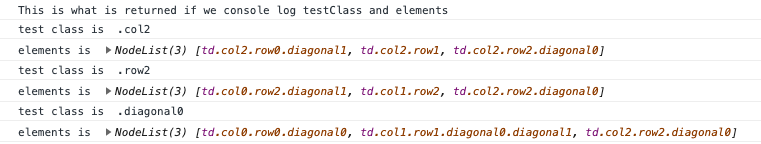

# Woody

## Introduction

https://guides.github.com/features/mastering-markdown/

Origin of the TicTacToe game - https://codepen.io/vasanthkay/pen/KVzYzG. 

I wanted to see if I could take this code, unpick the logic and then use it as the start of a coding project to determine 'a perfect game' in Woody. 

Outline of the logic behind the tictactoe game... 

All code is contained within 5 functions;
- init()
- startNewGame()
- win()
- contains()
- set()

The function init() get called when the code is run. init() is then calls startNewGame(). When it is called itit() applies the different sets of classes to the cells. In this way the code understands the relationship between cells - this is how it determines the win criteria. 

The function set() is called whenever a cell is clicked. The set() functions calls the win() function on each click to determine if the win criteria have been met. The set() function also sets a cell with the turn marker, 'X' or 'O'.  

The funcions win() and contains() work together to determine if win criteria have been met. 

The way that the code determines if the win criteria has been met is complicated but quite elegant.  

When we click a cell we look at the set of all cells that could be completed with your turn marker (e.g. 'X' or 'O') to result in a win. We then count how many of this set contain the turn counter. The code looks at each win 'set' in turn (e.g. the rows or columns that could result in a win). If this = 3 then this turn wins. --- (This requires more explanation, but is enough for me for now)

The code included some red herrings that made it a little bit harder to unpick. The concepts of a 'cell identifier' / 'score' were not needed for the code to behave correctly, so I removed these. 

## Changes I made to the code 

1. The first thing I did was remove the concept of turns (e.g. 'X' and 'O'). Woody is not a turn based game, so we're not going to need them. 

2. The next thing I did was remove the concept of diagonals. In Woody, only columns and rows are important. 

3. Then I made the grid 5x5. While this isn't as large as the 10x10 grid used in Woody, it will allow me to add the largest object used in woody to the grid (the 5xsquare column, or row). 

4. Next up - a completed row or column shouldn't result in a win - it should clear that row or column... and add to the score. To do this I modified the win() function and changed its name to clear(). I needed to modify the approach to the clear() function so that a column AND and a row would be cleared if the criteria was met for each of them. 

**************************************************************************************************************

to do... 

5. Start adding objects of different types! 
- How am I going to store the objects - Do it in a different module
- How am I going to 'place' the objects

6. I should add function descriptions to all of the functions

(It would be nice to be able to place the marker before the alert that tells you what has happened...)

Things to find out a little more about... 
1. The 'this' keyword in functions
2. [].filter
3. 

I should think about how to create the different shaped block objects 
Woody objects 

block objects. 

X - 1x1 square

XX - 2x2 square
XX

XXX - 3x3 square
XXX
XXX

Rows... 

XX 2x1 row 

XXX

XXXX

XXXXX

columns...

X 1x2 column
X

X
X
X

X
X
X

l-shapes... 

X
XX

X
X
XXXX

XX
 X

XXX
  X
  x

