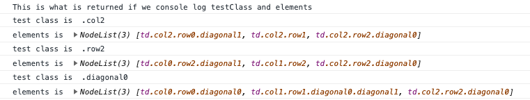
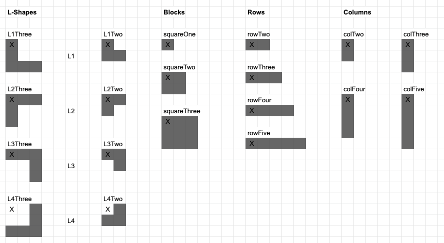
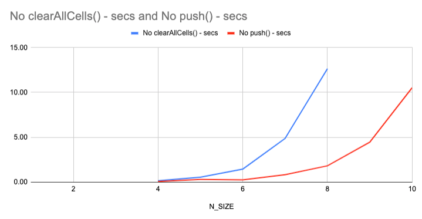

# Woody

## Introduction

https://guides.github.com/features/mastering-markdown/

Origin of the TicTacToe game - https://codepen.io/vasanthkay/pen/KVzYzG. 

I wanted to see if I could take this code, unpick the logic and then use it as the start of a coding project to determine 'a perfect game' in Woody. 

Outline of the logic behind the tictactoe game... 

All code is contained within 5 functions;
- init()
- startNewGame()
- win()
- contains()
- set()

The function init() get called when the code is run. init() is then calls startNewGame(). When it is called itit() applies the different sets of classes to the cells. In this way the code understands the relationship between cells - this is how it determines the win criteria. 

The function set() is called whenever a cell is clicked. The set() functions calls the win() function on each click to determine if the win criteria have been met. The set() function also sets a cell with the turn marker, 'X' or 'O'.  

The funcions win() and contains() work together to determine if win criteria have been met. 

The way that the code determines if the win criteria has been met is complicated but quite elegant.  

When we click a cell we look at the set of all cells that could be completed with your turn marker (e.g. 'X' or 'O') to result in a win. We then count how many of this set contain the turn counter. The code looks at each win 'set' in turn (e.g. the rows or columns that could result in a win). If this = 3 then this turn wins. --- (This requires more explanation, but is enough for me for now)

The code included some red herrings that made it a little bit harder to unpick. The concepts of a 'cell identifier' / 'score' were not needed for the code to behave correctly, so I removed these. 

## Changes I made to the code 

1. The first thing I did was remove the concept of turns (e.g. 'X' and 'O'). Woody is not a turn based game, so we're not going to need them. 

2. The next thing I did was remove the concept of diagonals. In Woody, only columns and rows are important. 

3. Then I made the grid 5x5. While this isn't as large as the 10x10 grid used in Woody, it will allow me to add the largest object used in woody to the grid (the 5xsquare column, or row). 

4. Next up - a completed row or column shouldn't result in a win - it should clear that row or column... and add to the score. To do this I modified the win() function and changed its name to clear(). I needed to modify the approach to the clear() function so that a column AND and a row would be cleared if the criteria was met for each of them. 

I ran into an issue with the first draft of the clear() function. I hardcode the set() function to be able to set two cells at the same time. This showed that the clear() function would only clear one column, if two columns were completed at the same time. I could simply call it twice (e.g. for each marked cell) to allow it to clear two columns. 

5. I needed to create a new function checkEmpty() which get called ahead of set() and does a check on all of the cells to make sure they are empty. If they are not then we cannot call set(). This solved the 'overlay' function - meaning blocks start to feel a bit more solid. I also check for 'offlay' within the same function. 

6. In order to be able to place different blocks, I created a new function processBlocks() that iterates through the block arrays and determines whether or not to set the cells based on the array content. In order to do this it first calls checkEmpty() and uses an array to store the results of that series of function calls. If every one of those calls is 'true', then the processBlocks() function will then call the set() function. 

7. Next up was the ability to select blocks. Four new function were needed for this. 

- buildBlockSelector() - This creates the html elements allowing the user to select the blocks. This function calls all the other functions. 
- blockSelected() - sets the blockSelected based on the html element clicked. 
- resetBlockSelector() - If there has been three clicks then refresh the block selector section. 
- chooseRandomBlock() - Returns a random block (string) every time it is called. 

During this process I realised it made sense to create an object to store the block arrays - this made them easier to access.

8. I finished up creating woody by making a few tweaks that made it easier for users to follow what was going on. This involved creating a few more global variables, which seemed a bit off - but I didn't want to concern myself too much about this at this stage. Also some faffing with CSS. Next up I want to create a BRAIN. 

## Creating the BRAIN.

1. Having built Woody, I wanted to create a way of playing it programatically - that way I could get testing different approaches and see if I could build a program that would allow me smash my high score. First up I needed a way of knowing how many cells were marked on the board. Having a large number of blank cells after each set of three blocks seemed like a good approach to a winning strategy. 

2. Having created another js file - I realised it made more sense to use the import/export from modules to keep things simple and orgnaised. 

3. The function automaticBlockPlacer() is the start of being able to iterate all the cells on the board, placing different blocks. It looked like it run in 5 thousandths of a milliseconds - but this didn't hold true at scale. 

Interesting point discovered - when I added an 'alert' inside a loop I couldn't see any change in the UI - This is becuase the DOM doesn't get updated while events are happening - https://javascript.info/event-loop. By adding a 'confirm' I could opt out of the loop. 

3. The function clearAllCells() does what it says on the tin. This will allow us to count each different variation of placed cells. The problem with this is that it turns out to be highly inefficient - it's making 100 calls to the DOM browser API. When I use it in combination 

4. Function automaticBlockPlacer() places every possible combination of available blocks. The issue is it takes too long to run! I think we are doing two expensive things; 
- Accessing the DOM via the browser API multiple times. 
- using push() to add elements to an array 

I tried the function with a few different variations. 
1. No clearAllCells() - Calling clearAllCells() was slowing things down a lot. Even though it's needed, I got rid of it for testing
2. No push() - I'm interested to see if this is what is causing things to slow down
3. No automaticProcessBlock() - How fast could it go, if it's not actually doing something - In this case it run in about 0.3 seconds when 10x10. 

I used performance.now() to measure how long the function takes to run.

automaticBlockPlacer() calls a number of other functions;
- automaticProcessBlock(), which then calls;
- - checkEmpty() and;
- - set() which then calls;
- - - clear();

5. I created a virtual board - I will now have to extend this, so I can use it to populate the 'real' board.
- I need a setVirtual()
- And a way of displaying the virtual board on the real board - I'll do all the virtual stuff in brain.js so that script.js can carry on working independently - no reasons why both things can't work side by side? I could even populate virtualBoard based on the content of the realBoard. 

*************************************************************************************************

to do... 

Adding the count of marked cells to an array seems to be very quick when I do it virtually 
5x5=0.024s
6x6=0.032s 
7x7=0.061s
8x8=0.128s
9x9=0.306s
10x10=0.699s
Clearly this is way better - but we're not placing blocks yet - and we're not calculating clearing them - so there are a number of function which will slow this down. If we virtualise all of them, 

1. automaticBlockPlacer is going to have to be made far more efficient. The current approach grinds to a halt at scale. 

2. 

I should also look at changing how I build the array to be more efficient - https://developer.mozilla.org/en-US/docs/Web/JavaScript/Reference/Global_Objects/TypedArray/set 

Additional stuff to do 
1. I should add function descriptions to all of the functions

2. I should replace var with let - check i can do this with no problem 

3. I should make it so that clear() results in a fadeout of cells rather than dissapearing... this might be tricky 

4. I should get my head around css grid. Seems like that is the way to go. 

5. Replace '==' with '==='

6. See this - https://levelup.gitconnected.com/javascript-refactoring-tips-making-functions-clearer-and-cleaner-c568c299cbb2

Things to find out a little more about... 
1. The 'this' keyword in functions
2. [].filter
3. Look into 'debugger'
4. Different between innerHTML and textContent 
5. Should a function ALWAYS explicetly 'return'
6. I need to figure out the best way to split a project across multiple files - what are modules?! 
7. Look into codespaces -https://onezero.medium.com/the-future-of-code-is-in-your-browser-2c51a08e8ab2

